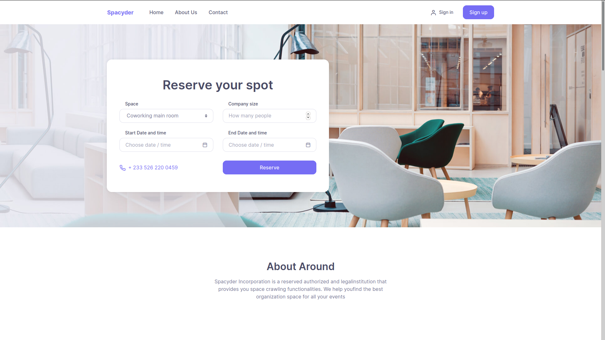
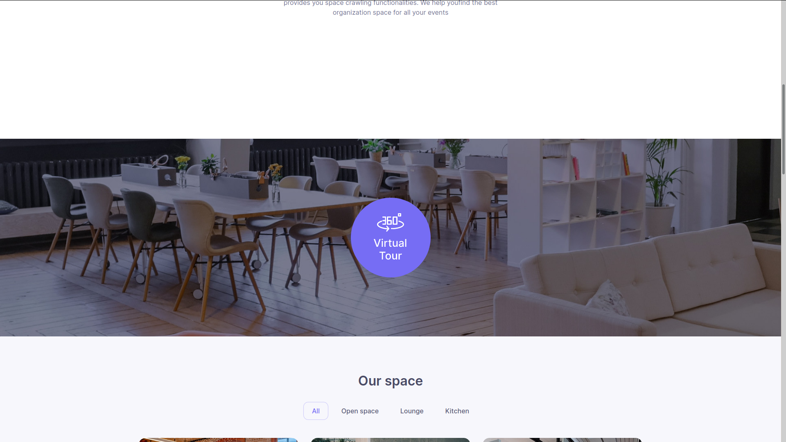
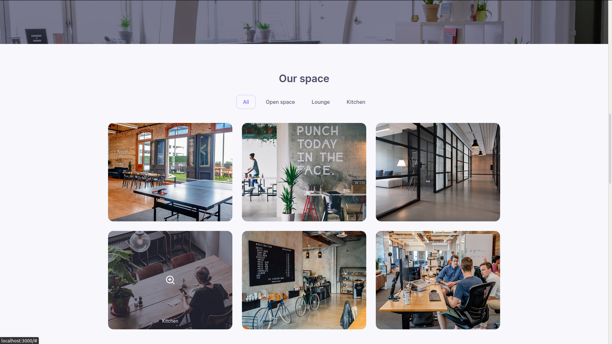
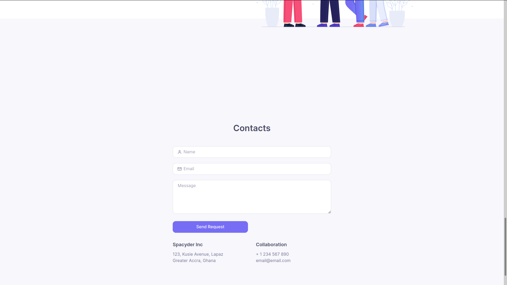
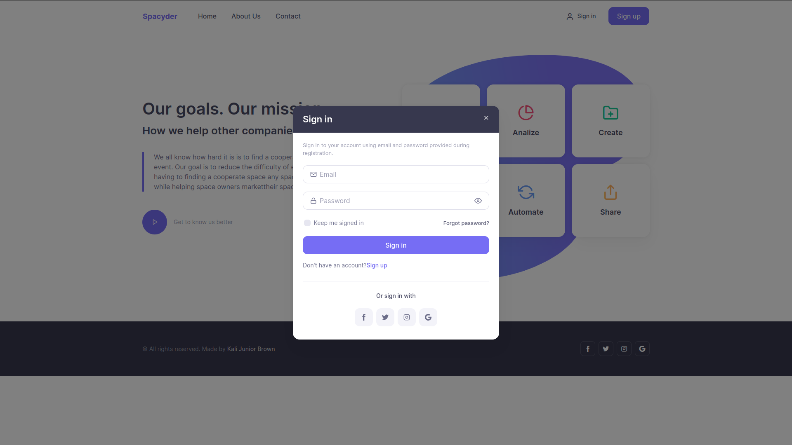
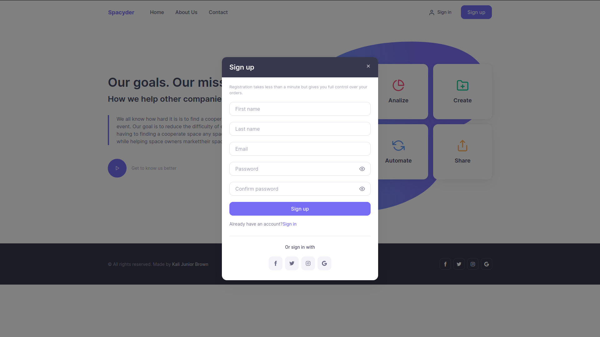
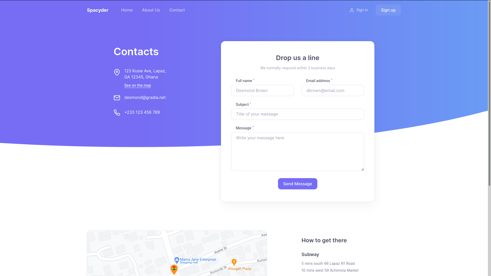
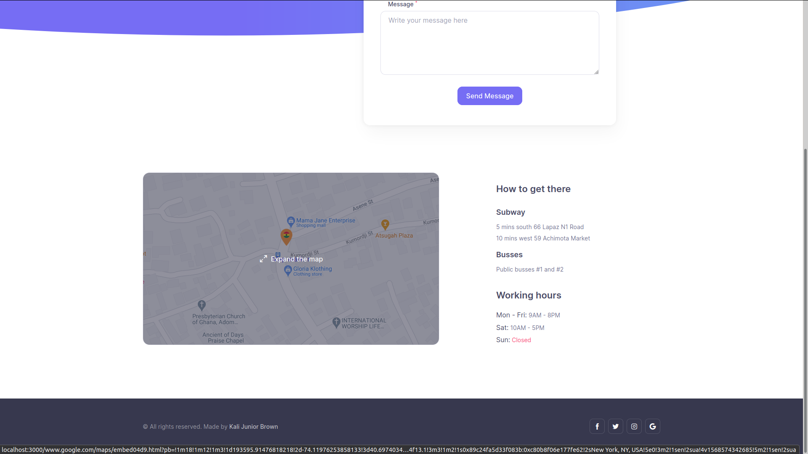
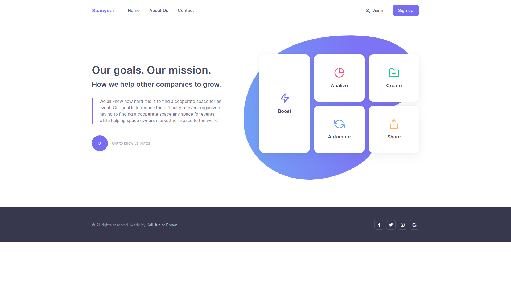

## SpaceSpyder (Written using the MERN Stack)

##### Description
A MERN Project that basically function like a space store where
users can place their space (could be office space, hotel space,
 corporate space, etc) for others in need of them to find and 
 reserve.
 
 
 ##### Features
 - Authentication System (Login/Logout)
 - Payment System
 - Reservation / Booking
 - Admin Dashboard
 - Email Subscription / Notification
 
 
 ##### Technology Stack
- Nodejs (Server-side run-time javascript engine)
- ExpressJS (Web Framework)
- React
- MongoDB

**NOTE**: Specific dependency requirements can be found
in the package.json file

##### Issues
- Most features are not yet implemented